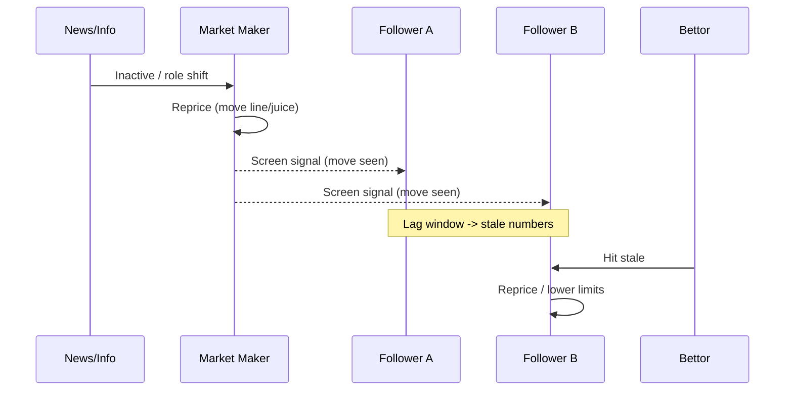

# NFL Player-Prop Market Microstructure × Coaching Schemes — Deep Research Pack (Consolidated)
_Date:_ 2025-09-25

> **Scope:** Consolidated, coach-aware research for **NFL player props** (not spreads/totals), covering **how markets are made/moved/monetized** and **how offensive/defensive schemes & coaching trees create repeatable mispricings by position**. Includes formulas (code-ready), diagrams (Mermaid), checklists, a tracker schema, and team profiles (2020–2025 focus).

---

## 0) Executive Summary (What to Do)
- **Exploit soft phases of the line lifecycle:** **openers** (low limits, higher error), **T-90 inactives window**, **retail copy-lag** after sharp **steam**.
- **Model & measure the edge:** log **overround**, **de-vig fair p**, **CLV** vs close; detect **steam** across K market-maker books.
- **Be coach-aware:** bake **scheme variables** (PROE, tempo, motion, personnel, coverage shell, blitz %, OL/DL win rates) into prop selection and timing.
- **Target recurring scheme→prop links:**
  - **2-high shells →** more **RB attempts**, **TE/slot receptions**, **QB under aDOT**.
  - **Blitz man (Cover‑1/0) →** **QB rush yards +**, **hot reads to RB/slot/TE +**, **deep WR volatility**.
  - **Single-high (Cover‑3/1) →** **WR deep/longest rec +**, **RB yards −** vs loaded box.
  - **High PROE/tempo →** **QB/WR volume overs**, **RB rush attempts unders**.
  - **Gap-power run O** vs light-box **Fangio trees →** **RB rush yards +** (volume efficiency).

---

## 1) Mechanics Brief: How Player-Prop Lines Are Made, Moved & Monetized

### 1.1 Market roles
- **Market makers (e.g., Pinnacle, Circa)**: originate/shape numbers; move **fast on sharp action/news**; limit ladders by phase.
- **Follower/retail books**: copy or shade; slower to move; monetize **vig**, **parlays/SGP**, and **public bias** (overs on stars/prime-time).

```mermaid
flowchart LR
  A[Origin: Model + Oddsmaker input] --> B[Openers (low limits)]
  B --> C[Shaping: sharp pings]
  C --> D[Limits Up: staged increases]
  D --> E[News Windows: inactives, weather]
  E --> F[Steam: K-book concurrence]
  F --> G[Retail Copy / Lag]
  G --> H[Close (efficient, high limits)]
  classDef phase fill:#eef,stroke:#445;
  class A,B,C,D,E,F,G,H phase;
```

**Monetization:** Books harvest **vig/overround** and public skew; sharps harvest **misprices** early/mid-cycle; late retail often bets into efficient closes.

### 1.2 Triggers that move props
- **Money:** respected accounts > public handle.
- **Information:** injuries/inactives (**T‑90**), weather, role changes, quotes.
- **Mirrors:** leader books move → copycats lag (arb/stale windows).



### 1.3 Key concepts
- **Steam move:** fast, concurrent multi-book move (often sharp/info driven).
- **Closing Line Value (CLV):** price you got vs close — persistent **+CLV** correlates with long‑term profit.
- **Mispricing windows:** openers; **T‑90** (inactives ripple); **retail lag**; **alts & SGP correlations**; **live props** after context shifts.

---

## 2) One‑Pager: Formulas & Code‑Ready Snippets

### 2.1 Odds conversions
```python
def american_to_decimal(usa):
    return 1 + (100/abs(usa) if usa < 0 else usa/100)

def decimal_to_implied_p(dec):
    return 1.0/dec

def american_to_implied_p(usa):
    d = american_to_decimal(usa)
    return 1.0/d
```

### 2.2 Overround / Vig (two‑way & multi‑way)
- **Overround (two‑way):** \( \\Omega = \sum_i 1/O_i \\) where \(O_i\) are decimal odds.
- **House margin:** \( \\Omega - 1 \).
- **De‑vig (proportional / equal‑margin):** \( p_i^{fair} = \frac{1/O_i}{\sum_j 1/O_j} \).

**Example (two‑way -115/‑115):**
- Decimal ~1.8696 each → implieds 0.5357+0.5357 = **1.0714** → **7.14%** overround.
- Fair probs = 0.5357 / 1.0714 = **0.5** each → fair decimal **2.00**.

```python
def overround_decimal(dec_prices):  # list of decimals
    return sum(1.0/d for d in dec_prices)

def devig_proportional(dec_prices):
    weights = [1.0/d for d in dec_prices]
    s = sum(weights)
    return [w/s for w in weights]  # fair probabilities
```

**Shin method (outline):** solve for \(\lambda\) (uninformed money fraction) then adjust \(p_i\) toward favorites. For two‑way props, proportional often suffices; for multi‑runner/favorite‑longshot bias, consider Shin.

### 2.3 CLV
- **Decimal CLV:** \( \mathrm{CLV} = \frac{O_{bet}}{O_{close}} - 1 \).
- **Probability CLV:** \( \frac{p_{close} - p_{bet}}{p_{bet}} \) where \(p=1/\text{decimal}\) on your side.
- **Logit delta:** \( \Delta = \log\frac{p_{close}}{1-p_{close}} - \log\frac{p_{bet}}{1-p_{bet}} \).

```python
import math
def clv_decimal(odds_bet_dec, odds_close_dec):
    return odds_bet_dec/odds_close_dec - 1.0

def clv_prob(p_bet, p_close):
    return (p_close - p_bet) / p_bet

def logit(x): return math.log(x/(1-x))
def clv_logit(p_bet, p_close): return logit(p_close) - logit(p_bet)
```

### 2.4 Steam detection (multi‑book, time‑window)
```python
from collections import deque
def steam_detector(book_lines_snapshots, k_concur=3, move_thresh_units=0.5, window_secs=90):
    """
    book_lines_snapshots: iterable of (ts, book, line_or_price)
    Return list of steam events: {ts, direction, books, from->to}
    """
    buf = deque()
    events = []
    for ts, book, val in book_lines_snapshots:
        buf.append((ts, book, val))
        # drop old
        while buf and ts - buf[0][0] > window_secs:
            buf.popleft()
        # check concurrence
        vals = {}
        for _, b, v in buf: vals.setdefault(b, []).append(v)
        # naive approach: compare each book's latest to earliest in window
        moves = []
        latest = {b: v[-1] for b,v in vals.items()}
        earliest = {b: v[0] for b,v in vals.items()}
        for b in latest:
            delta = latest[b] - earliest[b]
            if abs(delta) >= move_thresh_units:
                moves.append((b, delta))
        if len(moves) >= k_concur:
            direction = "UP" if sum(d for _,d in moves) > 0 else "DOWN"
            books = [b for b,_ in moves]
            frm = sum(earliest[b] for b,_ in moves)/len(moves)
            to  = sum(latest[b]   for b,_ in moves)/len(moves)
            events.append(dict(ts=ts, direction=direction, books=books, from_=frm, to=to))
    return events
```

**Tip:** Use *yardage units* for totals (e.g., +1.0 yard) or *price cents* for juice (e.g., +20¢).

---

## 3) Checklist: Prop Edge Zones

**Timing**
- **Openers (low limits):** strongest model edges; expect big moves.
- **T‑90 inactives:** react to role/carry/target shifts; hit backups’ overs before reprice.
- **Copy‑lag windows:** watch leader books; hit followers stuck at stale numbers.
- **Live/Halftime:** exploit context flips (injury/script/weather).

**Market type**
- **Alt lines:** tail mispricing; check distribution vs naive scaling.
- **SGP correlation:** hunt under‑adjusted correlated legs (e.g., QB rush over × sacks over).
- **Low‑liquidity props:** tackles/sacks/longest play often softer.

**Scheme/matchup**
- **Two‑high shells:** RB attempts↑, TE/slot targets↑, QB aDOT↓.
- **Blitz man:** QB rush↑, hot reads to RB/slot/TE↑, deep variance↑.
- **Cover‑3/1:** perimeter deep shots↑; slot sticks vs hook zones.
- **Tempo/PROE:** play volume lever → volume prop overs.
- **Fronts & OL/DL:** wide‑zone vs light boxes; power vs small fronts.

**Book type**
- **Market maker vs retail:** line‑shop; expect lag on followers.
- **Regional bias:** fade local overs; target shaded lines.
- **Promos/boosts:** compute fair vs boosted; clip +EV with limits.

---

## 4) “Bet‑That” Mapping (Tracker Schema)

**CSV columns**
```csv
date,time,game_id,player,team,opp,prop_type,side,line_bet,odds_bet,stake,book,open_line,open_odds,close_line,close_odds,dec_bet,dec_close,overround_open,overround_close,fair_p_open,fair_p_close,clv_decimal,clv_prob,steam_flag,scheme_tags,notes
```

**Sheet/Excel formulas (assuming decimal prices in cells):**
- Overround (two‑way, decimals in `A2:B2`): `=SUM(1/A2,1/B2)`
- Fair p (over, two‑way): `=(1/A2)/SUM(1/A2,1/B2)`
- Decimal CLV: `=D_bet/D_close - 1`
- Prob CLV: `=(1/D_close - 1/D_bet)/(1/D_bet)`

**Storage shape (app‑level/SQL)**
```sql
-- bets
bets(bet_id, ts_placed, game_id, player, team, opp, prop_type, side, line_bet, odds_bet_usa, odds_bet_dec, stake, book, scheme_tags, notes);
-- market snapshots
screens(snap_id, ts, book, market_key, side, line, odds_dec);
-- steam events
steam_events(event_id, ts, market_key, direction, k_books, from_value, to_value, notes);
-- settlement
closes(bet_id, close_ts, close_line, close_odds_dec, overround_close, fair_p_close, clv_decimal, clv_prob);
```

---

## 5) Coaching Trees & Scheme→Prop Maps

### 5.1 Offensive coaching trees
```mermaid
flowchart TD
  Walsh[Bill Walsh (WCO)] --> Holmgren --> Reid[Andy Reid]
  Reid --> Pederson
  Reid --> Nagy
  Coryell[Don Coryell (Air Coryell)] --> Turner[Norv Turner] --> LAC/DAL concepts
  Shanahan_Sr[Mike Shanahan (Wide Zone)] --> Kubiak --> Shanahan_Jr[Kyle Shanahan]
  Shanahan_Jr --> McVay
  Shanahan_Jr --> LaFleur
  McVay --> OConnell
  LaFleur --> Getsy
  Payton[Sean Payton (Erhardt-Perkins/WCO blend)] --> Carmichael
  Leach[Mike Leach (Air Raid)] --> Kingsbury --> Spread/Tempo
  Roman[Greg Roman (QB run/gap)] --> BAL concepts
  Riley[Lincoln Riley (Air Raid var.)] --> NFL concepts (RPO/deep cross)
```

**Prop implications (offense):**
- **Reid tree:** pass‑heavy, motion/jet; **QB/WR volume**, **RB rec**; red‑zone variety.
- **Shanahan/McVay:** wide‑zone + PA; **RB rush** vs light boxes; **WR YAC**; **QB aDOT modest**.
- **Payton:** matchup exploitation, RB in pass; **RB rec +**, **slot volume +**.
- **Air Raid:** tempo/spread; **WR volume +**, **QB yards +**, variability on efficiency.
- **Roman QB‑run:** **QB rush +/TD +**, lower WR volume.

### 5.2 Defensive coaching trees
```mermaid
flowchart TD
  Parcells --> Belichick[Belichick (game-plan man/match)]
  Belichick --> Flores --> NE/MIA man+blitz variants
  Carroll[Pete Carroll (SEA Cover-3)] --> Quinn --> Bradley --> Saleh
  Fangio[Vic Fangio (2-high match/quarters)] --> Staley --> Evero --> Ryans
  Bowles[Todd Bowles (blitz/pressure)] --> Caldwell (JAX)
  Ryan[Buddy/Rex Ryan (blitz/man)] --> Martindale
```

**Prop implications (defense):**
- **Fangio tree:** two‑high/light box → **RB attempts +**, **WR deep −**, **TE/slot +**.
- **Carroll Cover‑3:** seams & deep posts vs middle‑closed; **WR longest rec +**.
- **Belichick:** erases WR1 → **WR2/TE +**, **WR1 −**, **QB INT +** for youngsters.
- **Bowles/Ryan/Martindale:** heavy blitz/man → **QB rush +**, **hot read targets +**, **sacks +**.

### 5.3 Scheme → prop impact maps
```mermaid
flowchart LR
  A[Two-High Shells] -->|Run light box| B[RB Attempts ↑ / Yds ↑ (vol)]
  A --> C[QB aDOT ↓ / checkdowns ↑]
  C --> D[TE/Slot Receptions ↑]
  E[Blitz Man (C1/0)] --> F[QB Scrambles ↑ / Rush Yds ↑]
  E --> G[Hot Reads: RB/Slot/TE Receptions ↑]
  E --> H[Deep shots volatile (boom/bust)]
  I[Cover-3/1 Single-High] --> J[Perimeter Deep Shots / Longest Rec ↑]
  I --> K[Box loaded → RB Yds per carry ↓]
  L[High PROE + Tempo] --> M[QB/WR Volume Overs]
  L --> N[RB Rush Attempts Unders]
```

---

## 6) Team Pages (2020–2025) — Profiles & Angles

> **Format per team:** Coaching, Offense/Defense identities, Prop levers, Timing notes. (Short; expand as needed.)

### ARI — Arizona Cardinals
- **Coaches:** 2020–22 Kliff Kingsbury (Air Raid); 2023– Gannon/Petzing.
- **Offense:** Kingsbury tempo/spread; Kyler rush threat → **QB rush +**, **WR1 vol +**. 2023 run‑heavier → **RB attempts +**.
- **Defense:** 2020–22 Vance Joseph blitzy 3‑4 → **QB rush +**, **TE vs ARI +**. 2023 Rallis zone → **QB comp% +**, **slot/RB rec +**.
- **Angles:** **T‑90** WR inactive → backup WR overs; Kyler vs man → rush over.

### ATL — Atlanta Falcons
- **Coaches:** 2021– Arthur Smith (run‑heavy).
- **Offense:** extreme **−PROE**, slow; **RB attempts +**, **QB pass unders**, **WR rec unders** (volatility). Play‑action deep → **longest rec over** for London/Pitts.
- **Defense:** 2023 Nielsen improved pass D, deep prevention; earlier LB/RB coverage weak → **RB rec vs ATL +**.
- **Angles:** Fade pass volume; target **RB attempts**; vs stout run D, pivot to low WR overs.

### BAL — Baltimore Ravens
- **Coaches:** 2019–22 OC Greg Roman (QB run/gap), 2023– Todd Monken (balanced spread).
- **Offense:** Roman: **Lamar rush +**, **WR vols low**; Monken: **WR/TE vols up**, **tempo situational**.
- **Defense:** 2020–21 Martindale blitz/man → **QB rush +**, WR1 boom/bust; 2022– Macdonald multiple/zone → run D strong → **RB unders**.
- **Angles:** Lamar rush vs man; TE Andrews vol; under WRs vs Macdonald unless matchup spike.

### BUF — Buffalo Bills
- **Coaches:** Daboll → Dorsey (pass‑heavy continuity).
- **Offense:** top‑5 **+PROE**; **Allen pass/rush +**, **Diggs rec +**, **RB rush unders** (abandon run).
- **Defense:** two‑high zone; **deep WR −**, **slot/TE +**; run D solid → **RB unders**.
- **Angles:** Allen rush in big games; slot/TE overs vs zone; wind games → pass unders.

### CAR — Carolina Panthers
- **Coaches:** Rhule → Wilks; 2023 Reich/Brown → (staff changes).
- **Offense:** conservative/slow; 2022 run‑centric → **RB attempts +**; 2023 rookie QB → **pass unders**.
- **Defense:** 2023 Evero (Fangio) zone; **RB unders improving**, **slot/TE modest +**.
- **Angles:** Fade passing; vs CAR 2022 run D, hit **RB overs**; with Evero, pivot to pass vol unders.

### CHI — Chicago Bears
- **Coaches:** Nagy → Eberflus; OC Getsy.
- **Offense:** 2022–23 **Fields QB runs** → **QB rush +**, **QB pass unders**, **RB rush split/unders** (Fields cannibalizes).
- **Defense:** 2022 poor, 2023 better run D; zone → **slot/TE +**; low blitz.
- **Angles:** Hammer Fields rush vs man/blitz; fade Bears pass volume.

### CIN — Cincinnati Bengals
- **Coaches:** Zac Taylor (McVay tree).
- **Offense:** 11‑personnel, pass‑lean; **Burrow completions +** vs zone; **Chase longest rec +**, **Higgins overs in bracket‑Chase games**.
- **Defense:** Anarumo game‑plan, low blitz; brackets WR1 → **WR2 +**, deep limited.
- **Angles:** Weather; live 2H adjustments (opp QB under 2H).

### CLE — Cleveland Browns
- **Coaches:** Stefanski (wide‑zone PA); 2023 DC Schwartz.
- **Offense:** run‑lean; **Chubb rush +** (pre‑injury); **QB pass unders** when leading.
- **Defense:** 2022 run D poor → **RB overs**; 2023 elite pass D/run D → **QB/WR unders**, **RB unders**.
- **Angles:** Lake Erie wind → pass/FG unders.

### DAL — Dallas Cowboys
- **Coaches:** McCarthy; OC Moore (’20–’22) → Schottenheimer (’23).
- **Offense:** Moore era: aggressive pass → **Dak/Lamb overs**; 2023 slower/shorter → **Dak/Lamb unders early**, **Pollard rec +**.
- **Defense:** Dan Quinn pressure; **QB unders** vs weak OL; slot/TE can beat man.
- **Angles:** 1H over/2H under scripts; Parsons sack props.

### DEN — Denver Broncos
- **Coaches:** Hackett ’22 → Payton ’23; DC Fangio/Evero → Vance Joseph.
- **Offense:** 2022 Wilson unders; 2023 Payton run/PA → **RB attempts +**, **WR volatility**.
- **Defense:** Fangio/Evero zone elite (’21–’22) → **pass unders**; 2023 early collapse then improve.
- **Angles:** Track defense phase; adjust from auto‑overs early ’23 to unders mid‑year.

### DET — Detroit Lions
- **Coaches:** Dan Campbell; OC Ben Johnson.
- **Offense:** creative PA/motion, elite OL; **Amon‑Ra rec +**, **Goff home overs**, **Montgomery attempts +**, **Gibbs rec +**.
- **Defense:** 2023 stout run D → **RB unders**; pass D beatable → **QB/WR overs**.
- **Angles:** 4th‑down aggression → volume boosts.

### GB — Green Bay Packers
- **Coaches:** LaFleur (Shanahan); DC Joe Barry (2‑high).
- **Offense:** post‑Adams: **Jones rec +**, **Love deep variance → longest rec over for WRs**, **Love comps under**.
- **Defense:** light boxes → **RB rush overs vs GB**; limit deep → **WR deep unders**, **slot/TE +**.
- **Angles:** Lambeau weather → run heavy scripts.

### HOU — Houston Texans
- **Coaches:** 2023 Ryans/Slowik (Shanahan).
- **Offense:** **Stroud overs** with Collins/Dell; 2021–22 fade offense; **Pierce rush unders** 2023.
- **Defense:** 2021–22 Cover‑2 sieve vs run → **RB overs**; 2023 improving.
- **Angles:** Early 2023 lag on Stroud — now priced; still attack run D.

### IND — Indianapolis Colts
- **Coaches:** Reich → Steichen ’23.
- **Offense:** 2021 **Taylor rush +**; 2023 **Richardson rush + / pass under**; with Minshew **completions +**.
- **Defense:** Eberflus/Tampa‑2 → **RB unders, QB comps over**; Bradley C3 → more deep allowed.
- **Angles:** Indoors pace with Steichen: overs in shootouts.

### JAX — Jacksonville Jaguars
- **Coaches:** Pederson (’22–).
- **Offense:** **Lawrence overs** post‑mid ’22; **Kirk slot +**, **Ridley variance**, **Etienne rush+rec +**.
- **Defense:** Caldwell blitz/zone; run D decent; secondary beatable → **QB/WR overs**.
- **Angles:** Pederson aggressiveness → added volume.

### KC — Kansas City Chiefs
- **Coaches:** Reid.
- **Offense:** **Mahomes attempts/yds +** (context), **Kelce rec +**, **Pacheco rush +** when leading; SGP correlations abound.
- **Defense:** Spags pressure/man; 2023 pass D strong → **opp QB unders**, **TE safety valves +**.
- **Angles:** Big‑game Mahomes rush over; fade late 2H pass when leading.

### LV — Las Vegas Raiders
- **Coaches:** Gruden → McDaniels → Pierce.
- **Offense:** **Jacobs rush +**, **Adams vol +**, **Meyers overs mid‑’23**; Garoppolo long‑comp under.
- **Defense:** Below avg → **opp QB/WR overs**.
- **Angles:** Post‑coach change: star usage ↑ → target Jacobs/Adams volume.

### LAC — Los Angeles Chargers
- **Coaches:** Staley; OC Lombardi → Kellen Moore ’23.
- **Offense:** **Herbert overs**; **Keenan rec +**, **Ekeler rec +**, **Williams longest rec +**.
- **Defense:** Staley 2‑high, light box → **RB overs vs LAC**, **QB completions over**.
- **Angles:** Injury‑aware (WRs/OL); Staley 4th‑downs → volume.

### LAR — Los Angeles Rams
- **Coaches:** McVay.
- **Offense:** **Kupp rec/yds + (healthy)**, **Puka overs early ’23**, **Kyren Williams vol +** when lead back.
- **Defense:** Staley/Morris 2‑high; **WR1 under vs Ramsey(era)**; run middling.
- **Angles:** vs SF unders; venue indoor/outdoor splits for Stafford modest.

### MIA — Miami Dolphins
- **Coaches:** McDaniel.
- **Offense:** motion & speed; **Tyreek overs**, **Waddle situational overs**, **Tua yards/TD +** in good pass matchups; **Mostert/Achane spikes**.
- **Defense:** 2021 blitz/man → **QB rush +**; 2023 Fangio two‑high → **RB overs early**, **QB comps over**.
- **Angles:** Teams that press disrupt Tua → spot unders.

### MIN — Minnesota Vikings
- **Coaches:** O’Connell ’22–; DC 2022 Donatell → 2023 Flores.
- **Offense:** pass‑lean; **Jefferson overs**, **Addison overs when JJ out**, **Cousins attempts +**.
- **Defense:** 2022 soft zone → **opp QB/WR overs**; 2023 blitz mania → **QB INT/sacks +**, **hot reads +**.
- **Angles:** Blitz‑vs‑QB profile drives prop side.

### NE — New England Patriots
- **Coaches:** Belichick; OC churn.
- **Offense:** conservative; **RB rec (Stevenson) +**, **Mac pass unders** vs good rush.
- **Defense:** game‑plan erase WR1 → **WR1 under, WR2/TE over**, **rookie QB INT +**.
- **Angles:** Weather; matchups vs WR1‑centric offenses.

### NO — New Orleans Saints
- **Coaches:** Payton → Allen/Carmichael.
- **Offense:** **Kamara rec +**, **Olave yards +**, **Shaheed longest rec +**; red‑zone funk caps TDs.
- **Defense:** strong man/run D (’20–’22) → **RB unders**, **WR1 shadow vs Lattimore**.
- **Angles:** Dome boost for passing; Lattimore matchups.

### NYG — New York Giants
- **Coaches:** Daboll/Kafka.
- **Offense:** **Jones rush +** (’22), **pass unders**, **Saquon attempts +**; 2023 OL injuries → pass unders/sacks over.
- **Defense:** Wink Martindale blitz/man → **QB rush +**, **hot reads +**.
- **Angles:** vs heavy blitz, play RB/slot/TE overs.

### NYJ — New York Jets
- **Coaches:** Saleh; OCs LaFleur → Hackett.
- **Offense:** QB instability; **Garrett Wilson talent > volume**; **Breece Hall rush/rec +** when healthy.
- **Defense:** elite CBs (Sauce) in Cover‑3/Quarters → **WR1 under**, **slot/TE +**, low blitz.
- **Angles:** Fade outside WR1; target RB/slot.

### PHI — Philadelphia Eagles
- **Coaches:** Sirianni; OC Steichen → Brian Johnson.
- **Offense:** **Hurts rush TD+**, **AJB/DeVonta vol +**, **Swift rec+** depending usage; RPOs, tush‑push in RZ.
- **Defense:** 2022 Fangio‑influenced two‑high; 2023 coordinator change, run D issues → **RB overs vs PHI**.
- **Angles:** Hurts rush in high‑leverage; attack PHI LBs with TE.

### PIT — Pittsburgh Steelers
- **Coaches:** Tomlin; OC Canada (to 2023), then change.
- **Offense:** Canada era horizontal; **Pickens longest rec +**, **Najee vol but YPC −**; low tempo.
- **Defense:** strong edge rush; **QB under vs pressure**, **TE seams allowed occasionally**.
- **Angles:** Fade volume props in slow games; sacks over.

### SF — San Francisco 49ers
- **Coaches:** Kyle Shanahan.
- **Offense:** YAC machine; **CMC rush+rec +**, **Deebo rush+rec gadget +**, **Aiyuk efficiency +**; PA, motion.
- **Defense:** Wilks (’23) aggressive; elite front → **RB unders vs SF**, limited deep.
- **Angles:** Scheme touches to CMC/Deebo; avoid opp RB overs.

### SEA — Seattle Seahawks
- **Coaches:** Pete Carroll; OC Waldron (McVay tree).
- **Offense:** balanced + play‑action; **Metcalf longest rec +**, **Lockett 3rd‑down vol +**; RBs script‑driven.
- **Defense:** evolving from Cover‑3 to more 2‑high; run D variable.
- **Angles:** Deep shots vs single‑high looks.

### TB — Tampa Bay Buccaneers
- **Coaches:** Arians/Leftwich (’20–’22) → Bowles/Canales (’23).
- **Offense:** Brady era **+PROE**; Evans longest rec/TD +; 2023 Baker → **Evans yards/TD +**, Godwin volume.
- **Defense:** Bowles blitz/stout run → **RB unders vs TB**, **slot/TE can win vs blitz**.
- **Angles:** Attack with deep WR vs man; fade RBs.

### TEN — Tennessee Titans
- **Coaches:** Vrabel; OCs Smith → Downing → Tim Kelly.
- **Offense:** **Henry rush attempts +**, play‑action deep (Burks/Hopkins) → **longest rec +**; low pace.
- **Defense:** strong run D → **RB unders vs TEN**, secondary beatable → **WR overs**.
- **Angles:** Script‑driven Henry: lead → massive overs; trail → unders.

### WAS — Washington Commanders
- **Coaches:** Rivera; OC Scott Turner → Bieniemy (’23).
- **Offense:** 2023 heavy pass vol under EB → **Howell attempts +** (sacks too), **McLaurin/Thomas slot/TE +**.
- **Defense:** Del Rio (to ’23): front strong then trades; secondary beatable.
- **Angles:** High attempts/INT risk for young QB → completions over but sacks/INT over.

> **Note:** Team bullets summarize tendencies for 2020–2025; always validate with current health/roles.

---

## 7) QA & Failure Modes
1. **Mixing spread logic into props** → we treat medians for O/Us; avoid mean‑bias for alt lines (use distributional checks).
2. **Ignoring vig/overround** → we log overround and **de‑vig** to fair p before EV/CLV.
3. **Latency bias** → timestamp sources; prefer leader books for direction; tag **steam** vs **public**.
4. **Scheme drift** (coaching changes) → team pages flag coordinator shifts; update priors when OC/DC change.
5. **Correlation neglect (SGP/live)** → document assumptions; avoid overlapping legs unless correlation priced.

---

## 8) Uncertainties & Black‑Boxes
- **Limits/layoff & customer tiering:** proprietary risk systems vary by book; limit ladders and move sizes not fully public.
- **Player health/roles:** last‑minute usage can diverge from reports.
- **Alt/SGP pricing engines:** opaque correlation adjustments; test empirically.

---

## 9) Source List (Starter & Expert References)
- Circa oddsmaker perspective — *how lines are set*
- Pinnacle Betting Resources — *CLV, pricing, sharp vs public*
- Joseph Buchdahl — *CLV demystified, testing skill*
- Levitt (2004) — *Why are gambling markets organised so that…?*
- Follow‑ups on Levitt — *bookmaker behavior tests*
- Guides on **overround/vig** (Sporting Life; The Punter’s Page)
- Scheme primers (coaching trees; Fangio/Carroll/Belichick/Bowles; Air Raid; Roman QB‑run concepts)

*(Use these as primaries; add team‑specific beat‑writer/film sources for weekly adjustments.)*

---

## 10) Changelog
- **2025-09-25** — Consolidated mechanics, formulas, checklists; added coaching trees & team pages; tracker schema; Mermaid diagrams.

---

### Appendix A — Excel/Sheets snippets
- **American→Decimal**: `=IF(x<0,1+100/ABS(x),1+x/100)`
- **Decimal→Implied p**: `=1/dec`
- **De‑vig two‑way (over prob)**: `=(1/dec_over)/(1/dec_over+1/dec_under)`
- **CLV (decimal)**: `=bet_dec/close_dec-1`

### Appendix B — Minimal bet log template (CSV)
```csv
date,time,game_id,player,team,opp,prop_type,side,line_bet,odds_bet,stake,book,open_line,open_odds,close_line,close_odds,dec_bet,dec_close,overround_open,overround_close,fair_p_open,fair_p_close,clv_decimal,clv_prob,steam_flag,scheme_tags,notes
```
